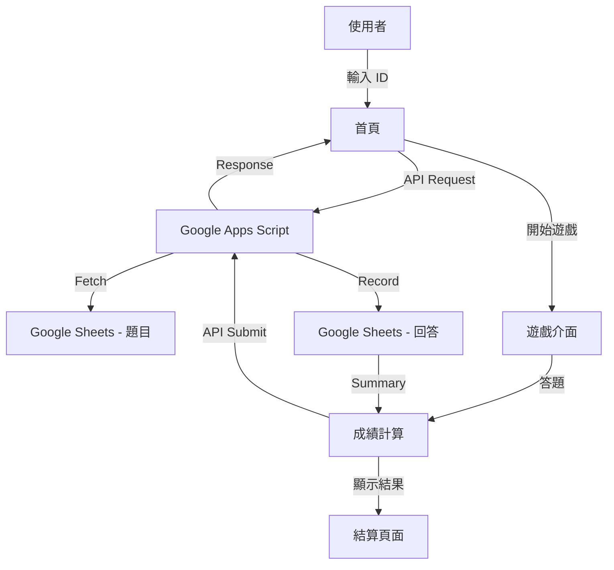
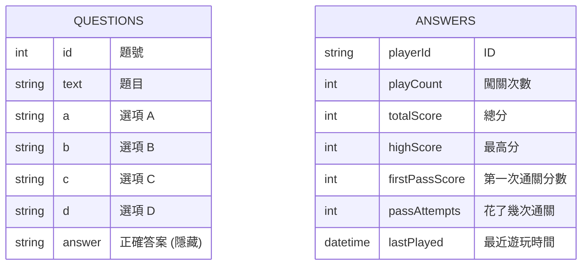

# Pixel Quiz Game - 闖關問答遊戲 規格文件

## 1. 專案概述
一個結合 Pixel Art 像素風格與 Google Sheets 後端的闖關問答遊戲。

## 2. 技術選型
- **前端框架**: React (Vite + TypeScript)
- **UI 樣式**: NES.css (像素風), TailwindCSS, Framer Motion
- **圖片來源**: DiceBear API (Pixel Art 素材)
- **後端與資料庫**: Google Apps Script + Google Sheets

## 3. 架構圖

## 4. 資料模型 (ER 圖)

## 5. 環境變數 (.env)
- `VITE_GOOGLE_APP_SCRIPT_URL`: GAS Web App API URL
- `VITE_PASS_THRESHOLD`: 通過門檻 (e.g., 80)
- `VITE_QUESTION_COUNT`: 每次隨機抓取的題目量 (e.g., 10)

## 6. 重要流程 - 答題計算
1. 前端將答題清單傳送至 GAS。
2. GAS 比對 Google Sheets 中的正確答案。
3. 計算分數並更新「回答」工作表。
4. 回傳當次得分、最高分、與通關狀態給前端。
